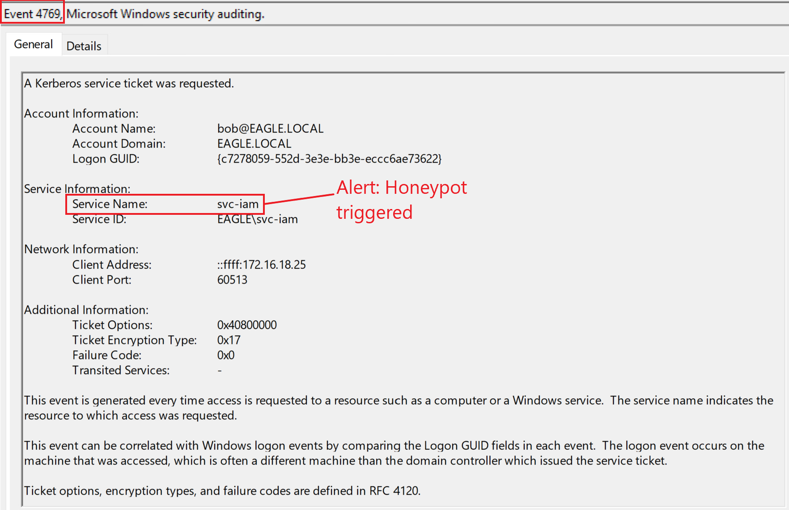
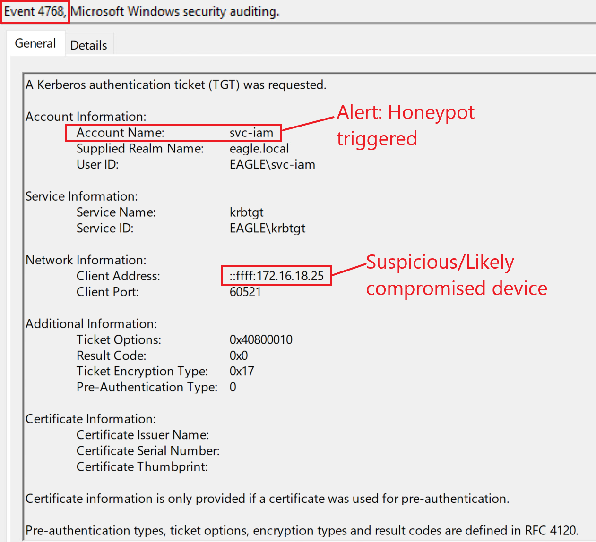

# Active_Directory_Preventing
Preventing Kerberoasting, AS-REPRoasting &amp; DCSync Attacks
While studying for the Certified Defensive Security Analyst (CDSA) exam from HackTheBox, I wanted to get a better understanding of some common Active Directory attacks and how to defend against them.
These are my own notes and thoughts after setting up a small AD lab and testing stuff out. I’ll go through Kerberoasting, AS-REPRoasting, and DCSync — what they are, how they work, and what can be done to prevent or detect them.

Kerberoasting

Kerberoasting basically abuses service accounts that have SPNs (Service Principal Names). Attackers can request service tickets for these accounts and try to crack the password offline. The whole attack depends on how weak the service account password is.

How to Prevent It

Use strong passwords for all accounts with SPNs — like really strong ones. Random 100+ characters is ideal (127 is the max in AD).

Limit the number of accounts with SPNs. If an account doesn’t need one, don’t assign it.

Do regular cleanups and disable or remove unused service accounts.

Use Group Managed Service Accounts (gMSA) where possible. AD manages them automatically and rotates their passwords (127 random characters). The only catch is not all applications support gMSAs yet — they work well with Microsoft stuff like IIS and SQL though.

Honeypot Idea

Setting up a fake user (honeypot) in AD is a great way to detect Kerberoasting.
Here’s what makes a good honeypot account:

Make it look old, like an old leftover service account.

Don’t change the password recently (keep it strong though). Ideally, it should be 2+ years old.

Give it some privileges so it looks interesting.

Assign it an SPN (for example, something like an IIS or SQL service).

If anyone requests a ticket for this honeypot account, that’s an immediate red flag.

 AS-REPRoasting

AS-REPRoasting targets accounts that have “Do not require Kerberos preauthentication” enabled. That flag allows attackers to grab password hashes from AS-REP responses and try to crack them offline.

🔧 Prevention

Don’t enable that setting unless absolutely necessary.

Do regular reviews (like every few months) to make sure no accounts have that property set accidentally.

For accounts that must have it, use a stronger password policy — something like 20+ characters.

Honeypot for Detection

You can also create a honeypot for AS-REPRoasting, but you need to make it look real.

Use an old account that seems like it’s been around for years.

For service accounts, keep the password at least 2 years old. For normal users, maybe less than a year.

Make sure it has some login history after the password change (so it doesn’t look suspicious).

Give it a few privileges to make it more believable.

If a TGT request ever shows up for this honeypot, that’s probably someone testing or attacking your AD.

DCSync

DCSync is a more advanced attack — it abuses the normal replication feature between domain controllers. Basically, it lets an attacker impersonate a DC and request all the password hashes.

How to Stop It

There’s not a direct way to disable replication, but you can limit it.
The best prevention is using something like RPC Firewall — it lets you control which RPC calls are allowed. You can configure it so only domain controllers can perform replication operations.

Link: https://github.com/zeronetworks/rpcfirewall

Quick Recap
Attack	How to Prevent It	Detection
Kerberoasting	Strong SPN passwords, use gMSA, limit SPNs	Honeypot with SPN
AS-REPRoasting	Avoid “no preauth”, strong passwords	Honeypot account
DCSync	Restrict replication with RPC Firewall	Monitor replication activity
Final Thoughts

Working on this in my AD lab really helped me understand how small misconfigurations can lead to major security issues.
Things like old service accounts, weak passwords, or unused SPNs are easy to overlook but can make attacks like Kerberoasting or AS-REPRoasting super effective.

Using strong password policies, automating account management (like with gMSAs), and deploying honeypots for early detection are simple but powerful ways to harden your environment.
